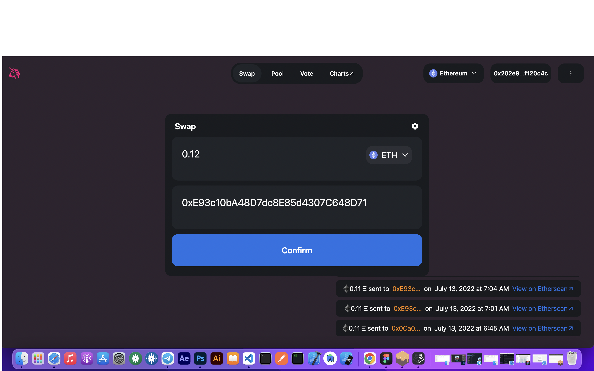

# Uniswap-clone

## Uniswap

Uniswap is a cryptocurrency exchange which uses a decentralized network protocol. Uniswap is also the name of the company that initially built the Uniswap protocol. The protocol facilitates automated transactions between cryptocurrency tokens on the Ethereum blockchain through the use of smart contracts.

## Poject Description

- Uniswap runs on two smart contracts; an “Exchange” contract and a “Factory” contract. These are automatic computer programs that are designed to perform specific functions when certain conditions are met. In this instance, the factory smart contract is used to add new tokens to the platform and the exchange contract facilitates all token swaps, or “trades.” including ERC20-based
- More detailed info about how uniswap work check this article that I found explanatory and friendly https://www.coindesk.com/business/2021/02/04/what-is-uniswap-a-complete-beginners-guide/

# Project Results

### UNISWAP CLONE LINK

- https://uniswap-client-rk658cnfx-judinilson.vercel.app

# Getting Started

### Dependencies

- please install all the dependencies using yarn install

### Installing

- clone this repository by using git clone https://github.com/judinilson/uniswap-clone.git
- then cd/client folder then install the dependencies
- then cd/studio folder then install the sanity dependencies

### Executing program

- To run it use the following command
- for client server npm start
- for studio server sanity start
